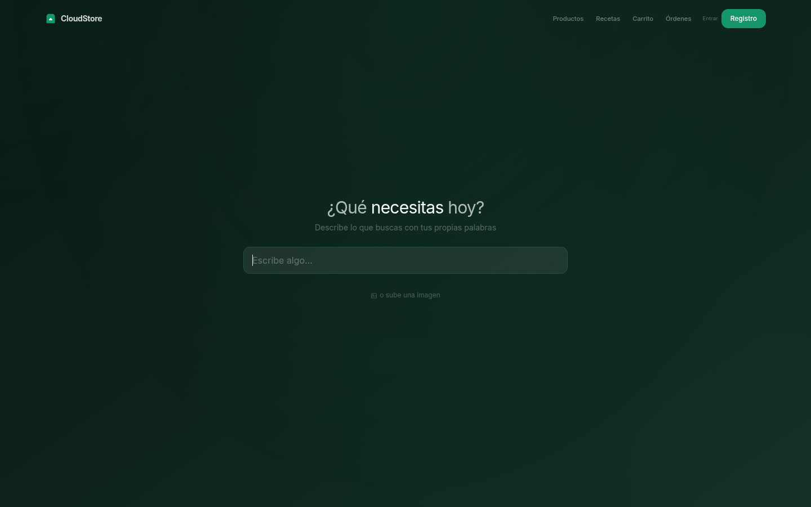
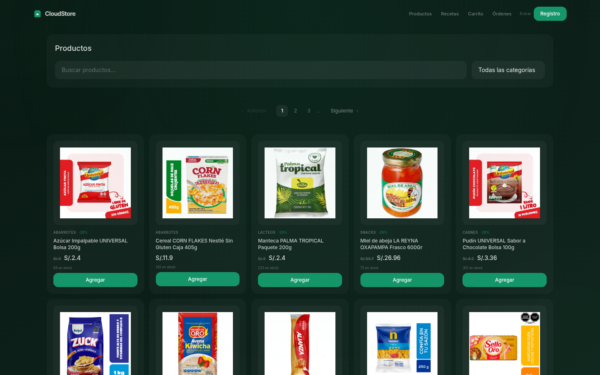
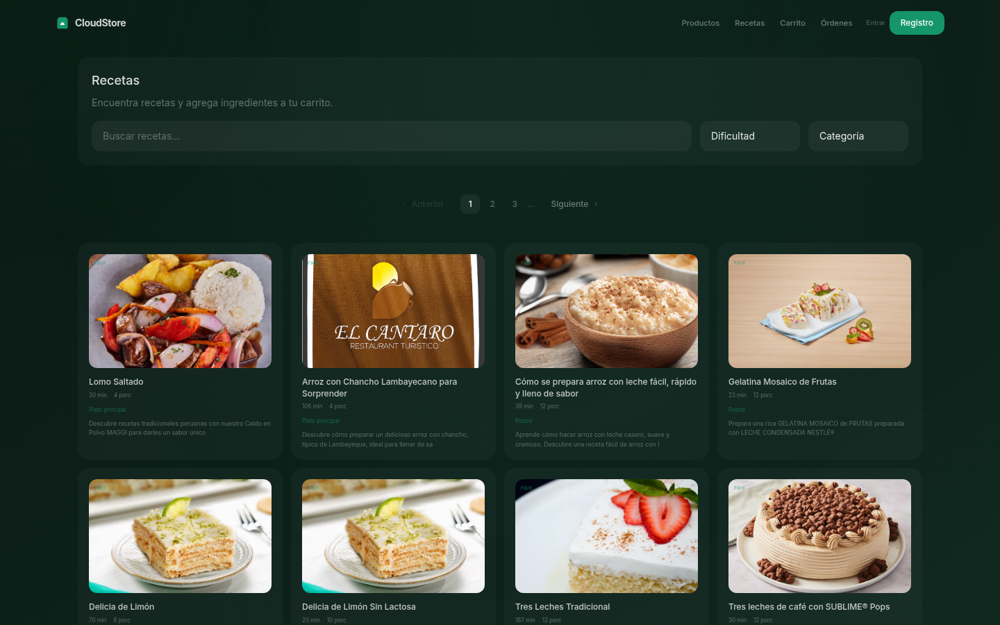
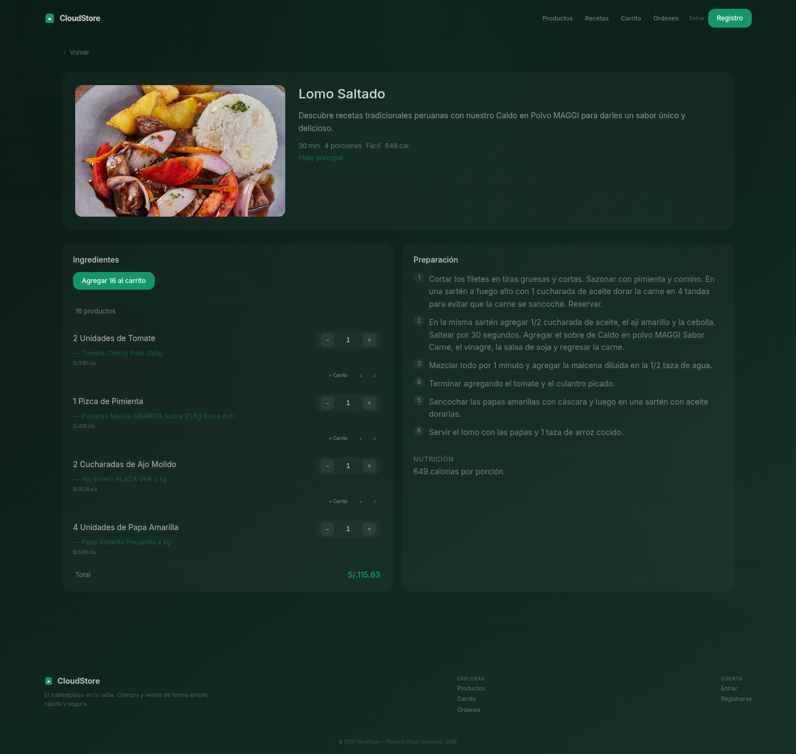

<div align="center">
  <br/>
  
  <br/><br/>

  <h1>
    
    CloudStore
  </h1>

  <p><strong>AI-Powered Marketplace · Mercado con Búsqueda por IA</strong></p>

  <p>
    
    
    
    
    
    
    
    
    
    
    
    
    
  </p>

  <br/>
</div>

---

## 🌐 English

**CloudStore** is a full-stack AI-powered marketplace built on self-hosted Supabase. Buyers explore products through semantic search (text + image), follow recipes with auto-mapped ingredients to the catalog, and purchase in one click. Sellers publish their products easily.

### ✨ Features

| | |
|---|---|
| 🔍 **AI Semantic Search** | Natural language product search with intent expansion ("I want to forget my ex" → beer/wine/liquor) |
| 📷 **Visual Search** | Upload an image — Gemma 4 vision identifies the product and finds matches |
| 🥘 **Recipe Catalog** | 445+ recipes from Recetas Nestlé Perú with ingredients auto-mapped to catalog products |
| 🛒 **One-Click Cart** | Add all recipe ingredients to cart at once, or adjust quantities individually |
| 🔄 **Ingredient Replace** | Swap any mapped product with a different one from the catalog |
| 💬 **Vision Chat** | Chat with Gemma 4 about any image — ask questions, get descriptions |
| 🎨 **Liquid Glass UI** | Dark emerald theme with glassmorphism cards, spring physics animations, kinetic orbs |
| 🔐 **Self-Hosted** | 100% local — PostgreSQL, Auth, Storage, Edge Functions, all via Docker Compose |
| 🚀 **Zero Trust Tunnel** | Cloudflare Tunnel (cloudflared) for public access without opening ports |

### 🖼️ Screenshots

<div align="center">
  <table>
    <tr>
      <td></td>
      <td></td>
    </tr>
    <tr>
      <td align="center"><em>AI-First Home — semantic search</em></td>
      <td align="center"><em>Product catalog with filters</em></td>
    </tr>
    <tr>
      <td></td>
      <td></td>
    </tr>
    <tr>
      <td align="center"><em>Recipe catalog with filters</em></td>
      <td align="center"><em>Recipe detail with ingredients + instructions</em></td>
    </tr>
  </table>
</div>

### 🏗️ Architecture

```
┌─────────────────────────────────────────────────────────────┐
│                   Cloudflare Tunnel                          │
├─────────────────────────────────────────────────────────────┤
│                    Nginx (port 8080)                         │
│            SPA serving + API reverse proxy                   │
├─────────────────────────────────────────────────────────────┤
│                       Kong (port 8000)                       │
│              API Gateway · key-auth · ACL · CORS             │
├────────┬────────┬────────┬────────┬────────┬────────┬───────┤
│  Auth   │  REST  │Storage │Realtime│  Edge  │ Studio │ DB   │
│ GoTrue  │PostgREST│ API  │Phoenix │  Deno  │ Admin  │ PG17 │
│ :9999   │ :3000  │:5000  │:4000   │:9000   │:3000   │:5432 │
└────────┴────────┴────────┴────────┴────────┴────────┴───────┘
                        │
              ┌─────────┴──────────┐
              │   PostgreSQL 17     │
              │   + pgvector        │
              │   + pg_trgm         │
              └────────────────────┘
```

### 🧠 AI Stack

| Model | Purpose | Provider |
|---|---|---|
| **bge-m3** | Text embeddings (1024d) for semantic search | Ollama (local) |
| **Gemma 4 (12B)** | Vision recognition + chat | MLX (local) |

### 🗄️ Database Schema

**Tables:** `profiles` · `products` · `cart_items` · `orders` · `order_items` · `recipes` · `recipe_ingredients`

**Search:** `hybrid_search(query_embedding, text_query)` — combines pgvector cosine similarity + PostgreSQL full-text search (`tsvector` in Spanish) with HNSW index.

### 🚀 Quick Start

```bash
# Prerequisites: Docker, Node.js 18+, Ollama with bge-m3

# 1. Start the full Supabase stack + frontend
sh run.sh start

# 2. Open Supabase Studio
open http://localhost:3333   # admin / admin123

# 3. Apply app migrations
docker compose exec db psql -U postgres -d postgres \
  -f /docker-entrypoint-initdb.d/cloudstore.sql

# 4. Scrape products and recipes, seed the database
node scripts/scraper.mjs
node scripts/scraper-nestle-recipes.mjs
node scripts/seed-recipes.mjs

# 5. Open the app
open http://localhost:8080
```

### 🔧 Frontend Dev

```bash
npm run dev       # Vite dev server on :8080
npm run build     # Production build
npm run preview   # Preview the build
```

### 🐳 Services

| Service | Image | Port |
|---|---|---|
| `frontend` | nginx:1.27-alpine | 8080 |
| `kong` | kong/kong:3.9.1 | 8000 |
| `auth` | supabase/gotrue:v2.189 | — |
| `rest` | postgrest/postgrest:v14.12 | — |
| `db` | supabase/postgres:17.6 | 5432 |
| `storage` | supabase/storage-api:v1.60 | — |
| `functions` | supabase/edge-runtime:v1.74 | — |
| `realtime` | supabase/realtime:v2.102 | — |
| `studio` | supabase/studio:2026.06 | 3333 |

---

## 🌐 Español

**CloudStore** es un marketplace impulsado por IA construido sobre Supabase auto-gestionado. Los compradores exploran productos mediante búsqueda semántica (texto + imagen), siguen recetas con ingredientes mapeados automáticamente al catálogo y compran con un solo clic. Los vendedores publican sus productos fácilmente.

### ✨ Características

| | |
|---|---|
| 🔍 **Búsqueda Semántica IA** | Búsqueda de productos en lenguaje natural con expansión de intenciones |
| 📷 **Búsqueda Visual** | Sube una imagen — Gemma 4 identifica el producto y encuentra coincidencias |
| 🥘 **Catálogo de Recetas** | 445+ recetas de Recetas Nestlé Perú con ingredientes mapeados al catálogo |
| 🛒 **Compra en 1 clic** | Agrega todos los ingredientes al carrito de una sola vez |
| 🔄 **Reemplazo de Producto** | Cambia cualquier producto mapeado por otro del catálogo |
| 💬 **Chat con Visión** | Chatea con Gemma 4 sobre cualquier imagen |
| 🎨 **Interfaz Liquid Glass** | Tema verde bosque con vidrio esmerilado, animaciones físicas, órbitas cinéticas |
| 🔐 **Auto-Gestionado** | 100% local — PostgreSQL, Auth, Storage, Edge Functions con Docker Compose |
| 🚀 **Túnel Zero Trust** | Cloudflare Tunnel para acceso público sin abrir puertos |

### 🖼️ Capturas de Pantalla

<div align="center">
  <table>
    <tr>
      <td></td>
      <td></td>
    </tr>
    <tr>
      <td align="center"><em>Inicio con búsqueda semántica</em></td>
      <td align="center"><em>Catálogo de productos con filtros</em></td>
    </tr>
    <tr>
      <td></td>
      <td></td>
    </tr>
    <tr>
      <td align="center"><em>Catálogo de recetas con filtros</em></td>
      <td align="center"><em>Detalle de receta con ingredientes + instrucciones</em></td>
    </tr>
  </table>
</div>

### 🏗️ Arquitectura

```
┌─────────────────────────────────────────────────────────────┐
│                   Cloudflare Tunnel                          │
├─────────────────────────────────────────────────────────────┤
│                    Nginx (puerto 8080)                       │
│            SPA + proxy inverso para APIs                     │
├─────────────────────────────────────────────────────────────┤
│                       Kong (puerto 8000)                     │
│              API Gateway · key-auth · ACL · CORS             │
├────────┬────────┬────────┬────────┬────────┬────────┬───────┤
│  Auth   │  REST  │Storage │Realtime│  Edge  │ Studio │  DB   │
│ GoTrue  │PostgREST│ API   │Phoenix │  Deno  │ Admin  │ PG17  │
│ :9999   │ :3000  │:5000   │:4000   │:9000   │:3000   │:5432  │
└────────┴────────┴────────┴────────┴────────┴────────┴───────┘
                        │
              ┌─────────┴──────────┐
              │   PostgreSQL 17     │
              │   + pgvector        │
              │   + pg_trgm         │
              └────────────────────┘
```

### 🧠 Stack de IA

| Modelo | Propósito | Proveedor |
|---|---|---|
| **bge-m3** | Embeddings de texto (1024d) para búsqueda semántica | Ollama (local) |
| **Gemma 4 (12B)** | Reconocimiento de imágenes + chat | MLX (local) |

### 🗄️ Esquema de Base de Datos

**Tablas:** `profiles` · `products` · `cart_items` · `orders` · `order_items` · `recipes` · `recipe_ingredients`

**Búsqueda:** `hybrid_search(query_embedding, text_query)` — combina similitud coseno de pgvector + búsqueda de texto completo de PostgreSQL (`tsvector` en español) con índice HNSW.

### 🚀 Inicio Rápido

```bash
# Requisitos: Docker, Node.js 18+, Ollama con bge-m3

# 1. Iniciar todo el stack de Supabase + frontend
sh run.sh start

# 2. Abrir Supabase Studio
open http://localhost:3333   # admin / admin123

# 3. Aplicar migraciones
docker compose exec db psql -U postgres -d postgres \
  -f /docker-entrypoint-initdb.d/cloudstore.sql

# 4. Scrapear productos y recetas, sembrar la BD
node scripts/scraper.mjs
node scripts/scraper-nestle-recipes.mjs
node scripts/seed-recipes.mjs

# 5. Abrir la aplicación
open http://localhost:8080
```

### 🔧 Desarrollo del Frontend

```bash
npm run dev       # Servidor de desarrollo Vite en :8080
npm run build     # Build de producción
npm run preview   # Vista previa del build
```

### 🐳 Servicios

| Servicio | Imagen | Puerto |
|---|---|---|
| `frontend` | nginx:1.27-alpine | 8080 |
| `kong` | kong/kong:3.9.1 | 8000 |
| `auth` | supabase/gotrue:v2.189 | — |
| `rest` | postgrest/postgrest:v14.12 | — |
| `db` | supabase/postgres:17.6 | 5432 |
| `storage` | supabase/storage-api:v1.60 | — |
| `functions` | supabase/edge-runtime:v1.74 | — |
| `realtime` | supabase/realtime:v2.102 | — |
| `studio` | supabase/studio:2026.06 | 3333 |

---

<div align="center">
  <br/>
  <sub>
    Built with ❤️ for Cloud Computing · UCSP<br/>
    
    <em> CloudStore — 2026</em>
  </sub>
  <br/><br/>
</div>
